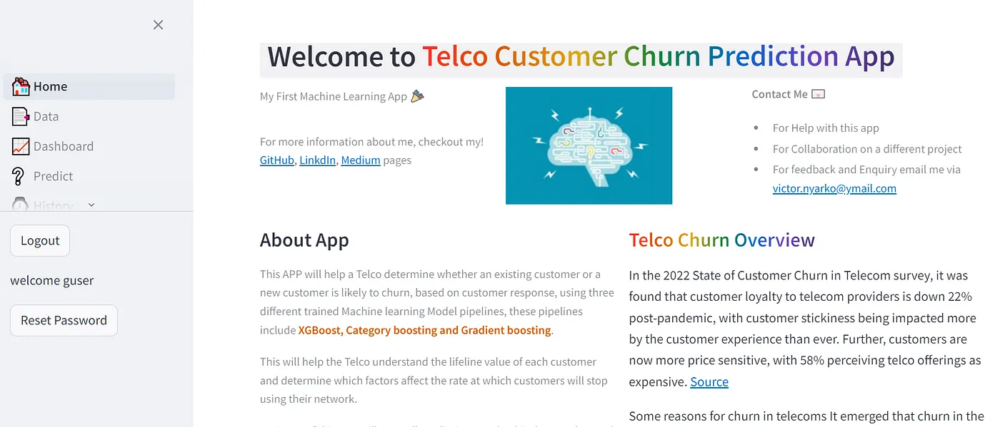

# Telco Customer Churn Prediction App 📲

Welcome to the **Customer Churn Prediction App Project** for embedding machine learning model to streamlit. The mission is to develop an app for predicting Customer churn rate using a previously trained Machine Learning model.


## Prerequisites 📈

Ensure that you install the following libraries in your Python environment or virtual environment:

* Streamlit
* Pandas
* CatBoost
* Xgboost
* Gradient Boost

For the full list, please refer to the requirements.txt file


<!-- GETTING STARTED -->

## 💻 Getting Started <a name="getting-started"></a>


To get a local copy up and running, follow these steps.

### Prerequisites

In order to run this project you need:

- Python


### Setup ⚙️

Clone this repository to your desired folder:


```sh
  cd my-folder
  git clone https://github.com/bamzyyyy/Telco-Customer-Churn-Prediction.git
```

Change into the cloned repository

```sh
  cd Telco-Customer-Churn-Prediction
  
```

Create a virtual environment

```sh

  python -m venv venv

```

Activate the virtual environment

```sh
  venv/Scripts/activate
```


### Install

Here, you need to recursively install the packages in the `requirements.txt` file using the command below 

```sh
   pip install -r requirements.txt
```


The app will be launched in your default web browser and can then be used to make customer churn predictions based on the input fields.

## Preview 🔍

### Home Page



### Data Page
 


### Dashboard Page
 


### Predict Page


### History Page


## Features ✅

**Customer Churn Prediction**: The app allows users to select their response based on predefined set of questions relating to demographics, service provisions by Telco, contract type, payment methods and charges. The user also have the option to choose between Xgboost, Gradient Boost and CatBoost models to make their prediction.

**Interactive Interface**: Streamlit provides an interactive, easy-to-use, web-based interface.

## Usage Instructions 📋

- Input Fields: The app displays input fields for the Gender, Seniorcitizen, Partner, Dependent, Tenure, Phoneservice, MultipleLines, InternetService, Onlinesecurity, onlinebackup, DeviceProtection, Monthlycharges, Totalcharges, Contracttype, Paperlessbilling, PaymentMethod, TechSupport, DeviceProtection, StreamingTV and StreamingMovies.
  
- Results: The app will display the predicted Churn rate for the specified inputs.

## Author 👨‍💼

  | Name                                            | LinkedIn                                                                                                                                                                                                                                               | Medium Article |
| ------------------------ | --------------------------------------------------------------------------------------------------------------------------------------------------------------------------------------------------- | ----------- |
| Victor Nyarko Anim | [My LinkedIn](https://www.linkedin.com/in/victor-anim-83115818/) |[My First Machine Learning App 🎉 for Predicting Telco customer Churn! Using Streamlit.👏](https://medium.com/@victor.nyarko/my-first-machine-learning-app-for-predicting-telco-customer-churn-50bfdb2ecb30)|

[App Link](https://lp4-telco-customer-churn-prediction-app-2.onrender.com/)

## Model Training and Saving ⏳

The Xgboost, Catboost and Gradient boost model was trained using the Telecommunication Customer Churn as shown in this GitHub repository: [LP4-Telco-Customer-Churn-Prediction-APP
](https://github.com/Koanim/LP4-Telco-Customer-Churn-Prediction-APP/).
## Acknowledgments 🙏

I would like to express my gratitude to the [Azubi Africa Data Analyst Program](https://www.azubiafrica.org/data-analytics) for their support and for offering valuable projects as part of this program. Not forgeting my scrum masters on this project [Rachel Appiah-Kubi](https://www.linkedin.com/in/racheal-appiah-kubi/) & [Emmanuel Koupoh](https://github.com/eaedk)

## License 📜

This project is licensed under the MIT License - see the [LICENSE.md](LICENSE.md) file for details.

## Contact 📧

For questions, feedback, and collaborations, please contact via [email](victor.nyarko@ymail.com).


<!-- CONTRIBUTING -->

## 🤝 Contributing <a name="contributing"></a>

Contributions, issues, and feature requests are welcome!

Feel free to check the [issues page](../../issues/).

<p align="right">(<a href="#readme-top">back to top</a>)</p>

<!-- SUPPORT -->

## ⭐️ Show your support <a name="support"></a>

If you like this project kindly show some love, give it a 🌟 **STAR** 🌟

<p align="right">(<a href="#readme-top">back to top</a>)</p>


